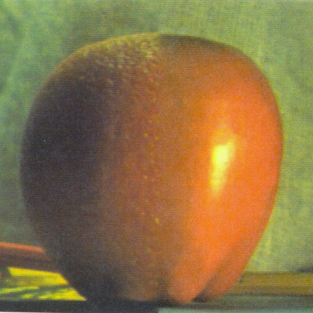
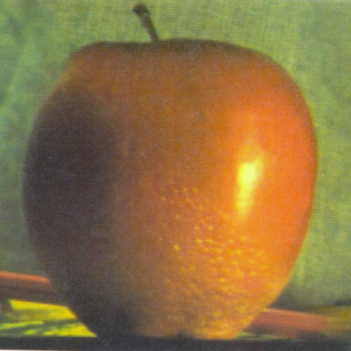
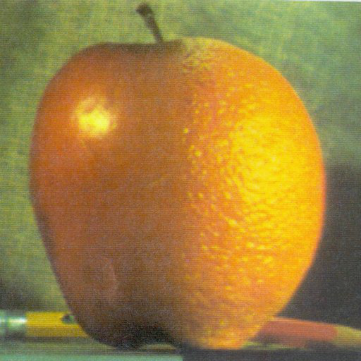
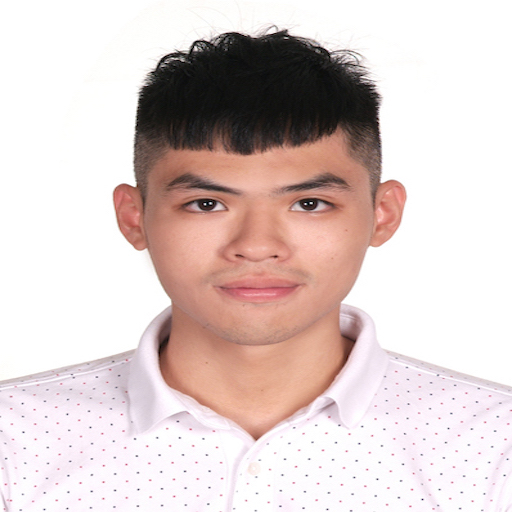
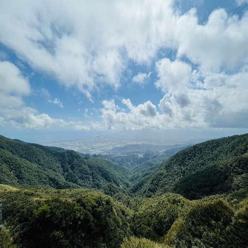
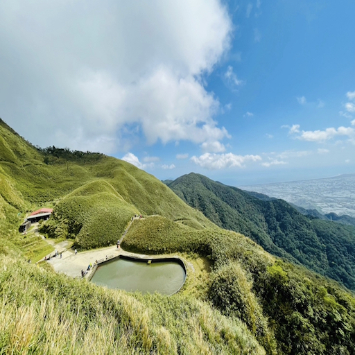
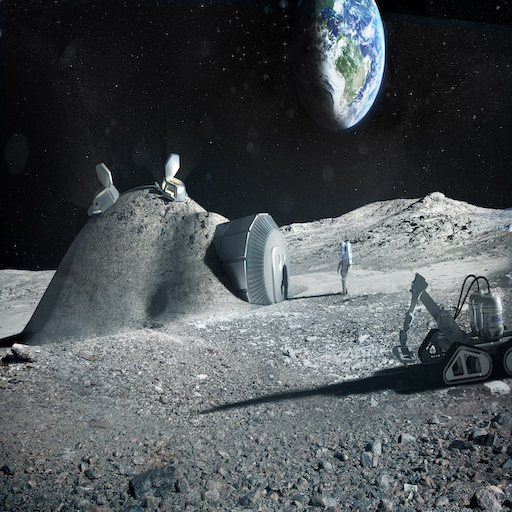
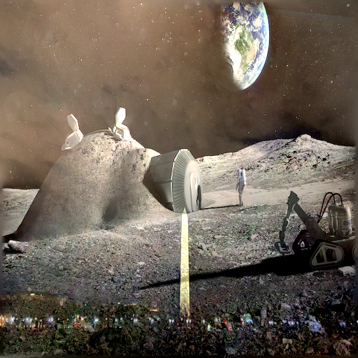

# Image Blending Using Pyramids
## CSC-676 Homework 3 / American University 
Author: [Yunting Chiu](https://www.linkedin.com/in/yuntingchiu)\
March 08, 2021

| This blending image from apple and orange |
|:--------------------:|
||

### Purpose
Suppose we start with two images: apple and orange. We need to blend two
image into one, consider taking the left half of the apple and combine
it beside each other with the right half of the orange to create a
blending picture. However, if we combine these two directly, the
blending picture will be very unnatural, and we will see the middle line
split between apple and orange. The main idea is that we need to use
Gaussian filter (low pass) and Laplacian filter (high pass) to generate
pyramids and then smoothly blend two different images into one. Here is
a following step:

1.  `def interpolate(image):` Interpolates an image with upsampling rate r=2.This needs to be scaled up since the kernel has a unit area.
2.  `def decimate(image):` Decimates an image with downsampling rate r=2.
3.  `def pyramids(image):` Constructs Gaussian and Laplacian pyramids. G is the Gaussian pyramid, L is the Laplacian pyramid.
4.  `def pyramidBlending(A, B, mask):` We have three images as input: input 1 and input 2 are the images we want to blend with, the third image is a mask image. The mask makes the image blend smooth. In this function, we call back the pyramids function spliting to three images to Gaussian and Laplacian pymarid. The picture blends smoothly when the Gaussian filter is applied to the subsampled mask. The mask's aim is to assist us in combining the Laplacian pyramids for both inputs. Finally, we apply the combined Laplacian to the original Gaussian-resized images multiplied by their respective masks to recreate the original image at each dimension. The following formula is`LS(i, j) = GR(I, j)\*LA(I, j) + (1-GR(I, j)\*LB(I, j))`.
5.  `def reconstruct(pyramid):` The next step is reconstructing the pyramids as well as upsampling and add up with each level. We need to reconstruct the original image using laplacian pyrimads of the image. The ideal idea is to reverse the order of the pyramids in order to start with the smallest pyramid.
6.  `def colorBlending(img1, img2, mask):` We know that a combination of three colors, namely Red, Green, and Blue, is an easy way to describe each pixel in image. This is what we are called the RGB image. In this case, we extract the RGB color from two images which we want to blend with, then call back the `reconstruct` and `pyramidBlending` functions we mentioned before to accomplish our final goal.

### Applications

We use Gaussian pyramid to blur and downsample image for each level. In order to eliminate the difference between each downsample image and the original image, we also compute the difference between the upsampled Gaussian pyramid level (k+1) and the Gaussian pyramid level(k). Laplacian Pyramids are a fantastic way to combine two images together. We can do a lot of things with image blending, such as texture synthesis, image compression, noise removal , and computing image
features.

## Example of Code

*Implementation of Image Blending using Gaussian pyramids and Laplacian pyramids in Python*

    # install the libraries
    import numpy as np
    import scipy.signal as sig
    from scipy import misc
    import matplotlib.pyplot as plt
    from scipy import ndimage
    import cv2
    import imageio
    from PIL import Image
    from google.colab.patches import cv2_imshow

    # create a  Binomial (5-tap) filter
    kernel = (1.0/256)*np.array([[1, 4, 6, 4, 1],[4, 16, 24, 16, 4],[6, 24, 36, 24, 6], [4, 16, 24, 16, 4],[1, 4, 6, 4, 1]])
    """
    plt.imshow(kernel)
    plt.show()
    """

    def interpolate(image):
      """
      Interpolates an image with upsampling rate r=2.
      """
      image_up = np.zeros((2*image.shape[0], 2*image.shape[1]))
      # Upsample
      image_up[::2, ::2] = image
      # Blur (we need to scale this up since the kernel has unit area)
      # (The length and width are both doubled, so the area is quadrupled)
      #return sig.convolve2d(image_up, 4*kernel, 'same')
      return ndimage.filters.convolve(image_up,4*kernel, mode='constant')
                                    
    def decimate(image):
      """
      Decimates an image with downsampling rate r=2.
      """
      # Blur
      #image_blur = sig.convolve2d(image, kernel, 'same')
      print(np.shape(image), np.shape(kernel))
      image_blur = ndimage.filters.convolve(image,kernel, mode='constant')
      # Downsample
      return image_blur[::2, ::2]                                
                   
                                          
      # here is the constructions of pyramids
    def pyramids(image):
      """
      Constructs Gaussian and Laplacian pyramids.
      Parameters :
      image  : the original image (i.e. base of the pyramid)
      Returns :
      G   : the Gaussian pyramid
      L   : the Laplacian pyramid
      """
      # Initialize pyramids
      G = [image, ]
      L = []

      # Build the Gaussian pyramid to maximum depth
      while image.shape[0] >= 2 and image.shape[1] >= 2:
        image = decimate(image)
        G.append(image)

      # Build the Laplacian pyramid
      for i in range(len(G) - 1):
        L.append(G[i] - interpolate(G[i + 1]))

      return G[:-1], L

    # [G, L] = pyramids(image)

    # Build Gaussian pyramid and Laplacian pyramids from images A and B, also mask
    # Reference: https://becominghuman.ai/image-blending-using-laplacian-pyramids-2f8e9982077f
    def pyramidBlending(A, B, mask):
      [GA, LA] = pyramids(A)
      [GB ,LB] = pyramids(B)
      # Build a Gaussian pyramid GR from selected region R 
      # (mask that says which pixels come from left and which from right)
      [Gmask, LMask] = pyramids(mask)
      # Form a combined pyramid LS from LA and LB using nodes of GR as weights
      # Equation: LS(i, j) = GR(I, j)*LA(I, j) + (1-GR(I, j)* LB(I, j))
      # Collapse the LS pyramid to get the final blended image
      blend = []
      for i in range(len(LA)):
        # LS = np.max(Gmask[i])*LA[i] + (1-np.max(Gmask[i]))*LB[i]
        # make sure the color with in 255 (white)
        LS = Gmask[i]/255*LA[i] + (1-Gmask[i]/255)*LB[i]
        blend.append(LS)
      return blend

    # reconstruct the pyramids as well as upsampling and add up with each level
    def reconstruct(pyramid):
      rows, cols = pyramid[0].shape
      res = np.zeros((rows, cols + cols//2), dtype= np.double)
      # start the smallest pyramid so we need to reverse the order
      revPyramid = pyramid[::-1]
      stack = revPyramid[0]
      # start with the second index
      for i in range(1, len(revPyramid)):
        stack = interpolate(stack) + revPyramid[i] # upsampling simultaneously
      return stack

    # https://compvisionlab.wordpress.com/2013/05/13/image-blending-using-pyramid/
    # Besides pyramid Blending, we need to blend image's color
    def colorBlending(img1, img2, mask):
      # split to 3 basic color, then using pyramidBlending and reconstruct it, respectively
      img1R,img1G,img1B = cv2.split(img1)
      img2R,img2G,img2B = cv2.split(img2)
      R = reconstruct(pyramidBlending(img1R, img2R, mask))
      G = reconstruct(pyramidBlending(img1G, img2G, mask))
      B = reconstruct(pyramidBlending(img1B, img2B, mask))
      output = cv2.merge((R, G, B))
      imageio.imsave("output.png", output)
      img = cv2.imread("output.png")
      cv2_imshow(img)

    apple = imageio.imread('apple.jpg')
    orange = imageio.imread('orange.jpg')
    mask = cv2.imread('mask.jpg', 0)
    colorBlending(apple, orange, mask)

### Results in a table

| Source             |  Destination  |Mask       | Blended|
|:--------------------:|:--------------------:|:--------------------:|:--------------------:|
 |  | | ||
 |  | || |

### Good Cases

- Picked up the white background pictures from me and my friend.

- Hotpot goes well with chocolate.

- I created a new landscape by combining the two mountains.

| Source             |  Destination  |Mask       | Blended|
|:--------------------:|:--------------------:|:--------------------:|:--------------------:|
| |||
||||
| ||||

### Poor Cases

- The color of two images is extremely different

| Source             |  Destination  |Mask       | Blended|
|:--------------------:|:--------------------:|:--------------------:|:--------------------:|
| | |||

## Implement Poisson image blending

*Example of code in Python*

    # Import libraries
    import numpy as np
    import matplotlib.pyplot as plt
    import cv2
    import imageio
    from google.colab.patches import cv2_imshow
    
    def PoissonImageBlending(source, destination):
      # create an all "White" mask: 255, if black mask is 0
      mask = 255 * np.ones(destination.shape, destination.dtype) 
      # navigate the source img location
      width, height, channels = source.shape
      center = (height//2, width//2)
    
      # using built-in funtion `cv2.seamlessClone` to acommpulish Poisson Image
      blended = cv2.seamlessClone(destination, source, mask, center, 2) # cv::MIXED_CLONE = 2
      output = blended
      imageio.imsave("output.png", output)
      img = cv2.imread("output.png")
      cv2_imshow(img)

    # run it!!
    source = imageio.imread("dc.jpg")
    destination = imageio.imread("moon.jpeg")
    PoissonImageBlending(source, destination)
    
### Results in a table
- Like Dogecoin, Washington Monument is going to the moon.

| Source         |  Destination  |Mask    | Blended|
|:--------------------:|:--------------------:|:--------------------:|:--------------------:|
| | | | |

  
**Please visit my [GitHub](https://github.com/twyunting) page if you are interested in knowing more about my academic projects in Computer Vision.**
